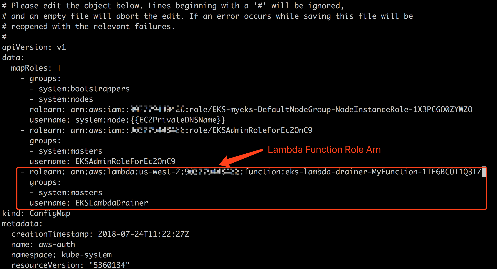
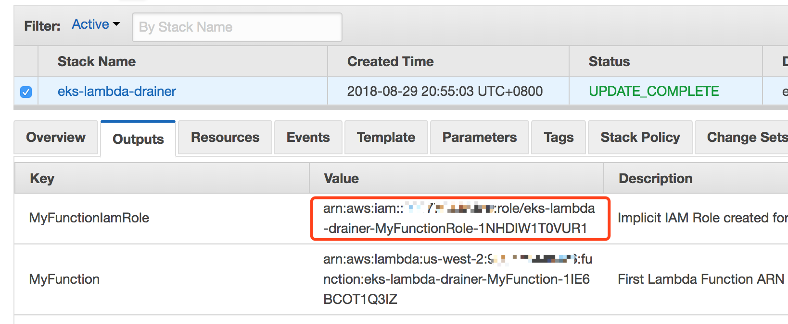
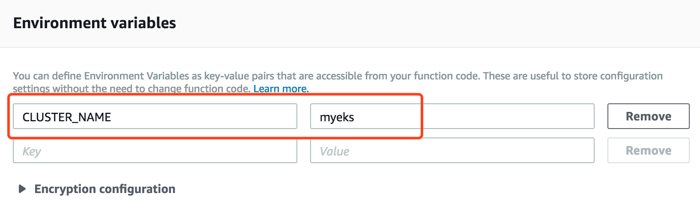
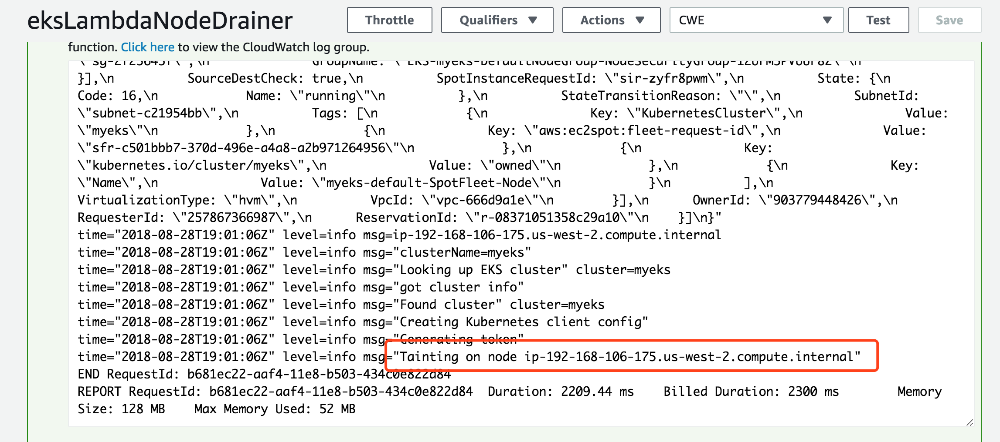
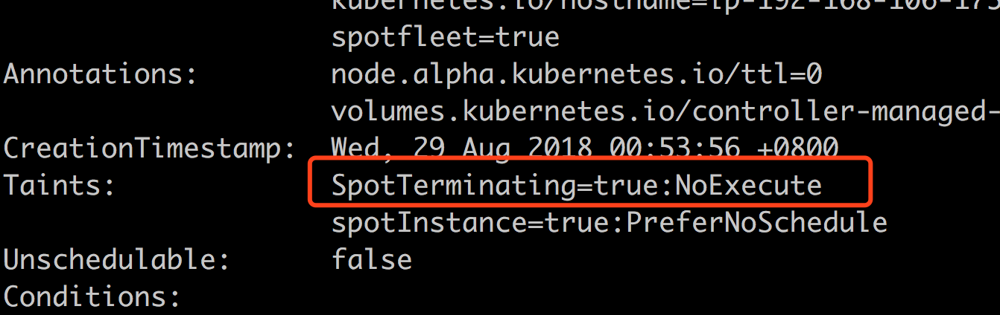

# eks-lambda-drainer

**eks-lambda-drainer** is an Amazon EKS node drainer with AWS Lambda. If you provision spot instances or spotfleet in your Amazon EKS nodegroup, you can listen to the spot termination signal from **CloudWatch Events** 120 seconds in prior to the final termination process. By configuring this Lambda function as the CloudWatch Event target, **eks-lambda-drainer**  will perform the taint-based eviction on the terminating node and all the pods without relative toleration will be evicted and rescheduled to another node - your workload will get very minimal impact on the spot instance termination.


# Installation

Install and deploy **eks-lambda-drainer** with **AWS Serverless Application Repository**(TBD).


# Add Lambda Role into ConfigMap

Read Amazon EKS [document](https://docs.aws.amazon.com/eks/latest/userguide/add-user-role.html) about how to add an IAM Role to the `aws-auth` ConfigMap. 

Edit the `aws-auth` ConfigMap by 

```
kubectl edit -n kube-system configmap/aws-auth
```

And insert `rolearn`, `groups` and `username` into the `mapRoles`, make sure the groups contain `system:masters`




You can get the `rolearn` from the output tab of cloudformation console.




# Configuration

Configure your Amazon EKS cluster name in the Lambda environment variables.




# In Actions







# TODO

- [ ] package the Lambda function in [AWS SAM](https://docs.aws.amazon.com/lambda/latest/dg/serverless_app.html) format
- [ ] publish to [AWS Serverless Applicaton Repository](https://aws.amazon.com/tw/serverless/serverlessrepo/)
- [ ] add more samples