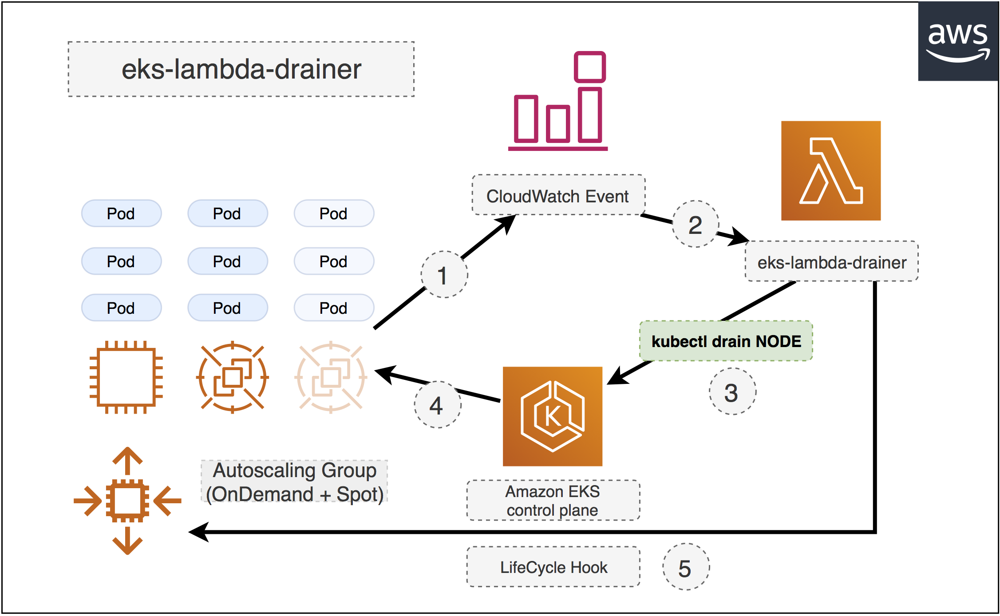
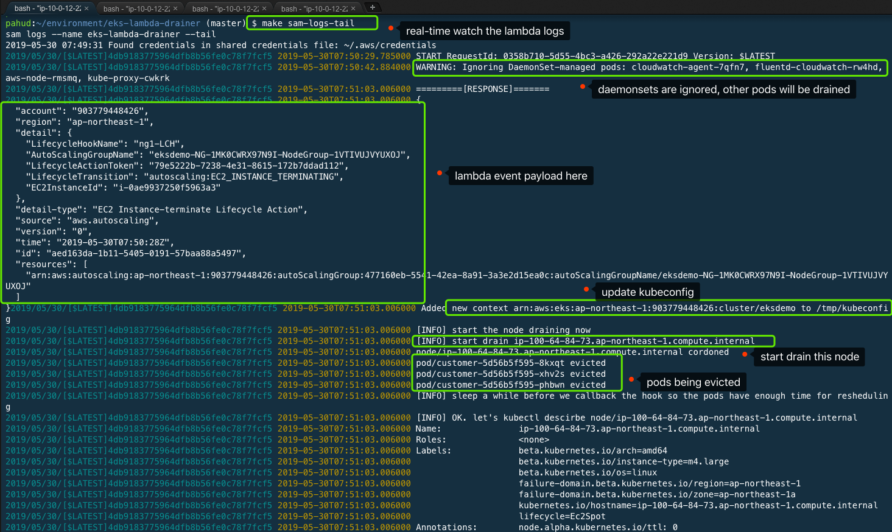
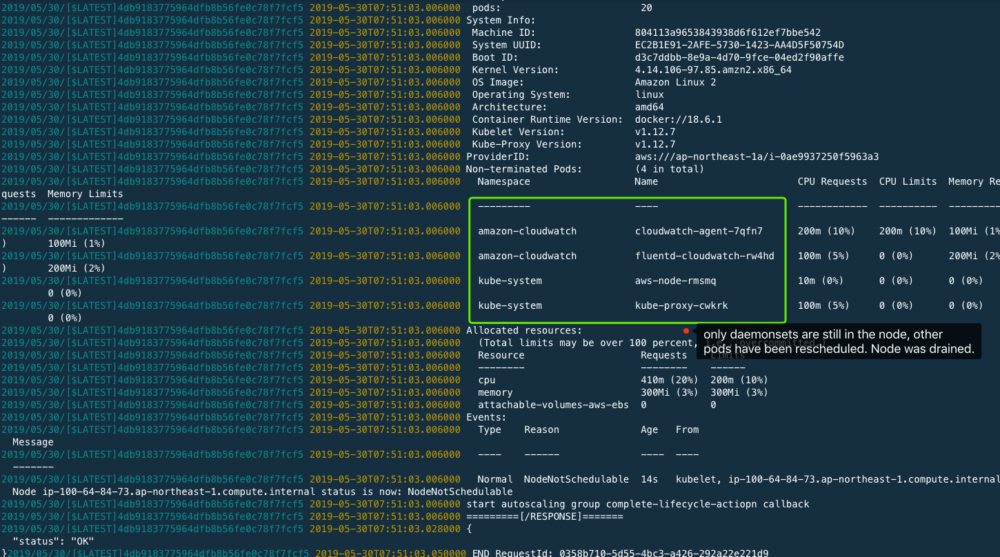

## Amazon EKS Serverless Drainer

Amazon EKS node drainer with AWS Lambda.

[](https://serverlessrepo.aws.amazon.com/#/applications/arn:aws:serverlessrepo:us-east-1:903779448426:applications~eks-lambda-drainer)

**amazon-eks-serverless-drainer** is an Amazon EKS node drainer with AWS Lambda. If you provision spot instances or spotfleet in your Amazon EKS nodegroup, you can listen to the spot termination signal from **CloudWatch Events** 120 seconds in prior to the final termination process. By configuring this Lambda function as the CloudWatch Event target, **amazon-eks-serverless-drainer**  will drain the terminating node and all the pods without relative toleration will be evicted and rescheduled to another node - your workload will get very minimal impact on the spot instance termination.




## Implementations

- `golang` implementation([branch](https://github.com/pahud/eks-lambda-drainer/tree/golang))
- `bash` implementation(current master branch)

Previously this project has a native `golang` implementation with `client-go`(see `golang` [branch](https://github.com/pahud/eks-lambda-drainer/tree/golang)).
However, as AWS [announced](https://amzn.to/2SUlcv3) `Lambda layer` and `Lambda custom runtime`, thanks to the [aws-samples/aws-lambda-layer-kubectl](https://github.com/aws-samples/aws-lambda-layer-kubectl) project,
it's very easy to implement this with a few lines of bash script in Lambda([tweet](https://twitter.com/pahudnet/status/1095369690556162049)) whilst the code size could be reduced from `11MB` to just `2.4KB`.
So we will stick to `bash` implementation in this branch. We believe this will eliminate the complexity to help people develop similar projects in the future.


# Option 1: Deployt from SAR(Serverless App Repository)

The most simple way to build this stack is creating from SAR:

Edit `Makefile` and then

```bash
$ make sam-package-from-sar sam-deploy
```
Or just click the button to deploy


|        Region        |                    Click and Deploy                     |
| :----------------: | :----------------------------------------------------------: |
|  **us-east-1** | [](https://deploy.serverlessrepo.app/us-east-1/?app=arn:aws:serverlessrepo:us-east-1:903779448426:applications/eks-lambda-drainer) |
|  **us-east-2** | [](https://deploy.serverlessrepo.app/us-east-2/?app=arn:aws:serverlessrepo:us-east-1:903779448426:applications/eks-lambda-drainer) |
|  **us-west-1** | [](https://deploy.serverlessrepo.app/us-west-1/?app=arn:aws:serverlessrepo:us-east-1:903779448426:applications/eks-lambda-drainer) |
|  **us-west-2** | [](https://deploy.serverlessrepo.app/us-west-2/?app=arn:aws:serverlessrepo:us-east-1:903779448426:applications/eks-lambda-drainer) |
|  **ap-northeast-1** | [](https://deploy.serverlessrepo.app/ap-northeast-1/?app=arn:aws:serverlessrepo:us-east-1:903779448426:applications/eks-lambda-drainer) |
|  **ap-northeast-2** | [](https://deploy.serverlessrepo.app/ap-northeast-2/?app=arn:aws:serverlessrepo:us-east-1:903779448426:applications/eks-lambda-drainer) |
|  **ap-southeast-1** | [](https://deploy.serverlessrepo.app/ap-southeast-1/?app=arn:aws:serverlessrepo:us-east-1:903779448426:applications/eks-lambda-drainer) |
|  **ap-southeast-2** | [](https://deploy.serverlessrepo.app/ap-southeast-2/?app=arn:aws:serverlessrepo:us-east-1:903779448426:applications/eks-lambda-drainer) |
|  **eu-central-1** | [](https://deploy.serverlessrepo.app/eu-central-1/?app=arn:aws:serverlessrepo:us-east-1:903779448426:applications/eks-lambda-drainer) |
|  **eu-west-1** | [](https://deploy.serverlessrepo.app/eu-west-1/?app=arn:aws:serverlessrepo:us-east-1:903779448426:applications/eks-lambda-drainer) |
|  **eu-west-2** | [](https://deploy.serverlessrepo.app/eu-west-2/?app=arn:aws:serverlessrepo:us-east-1:903779448426:applications/eks-lambda-drainer) |
|  **eu-west-3** | [](https://deploy.serverlessrepo.app/eu-west-3/?app=arn:aws:serverlessrepo:us-east-1:903779448426:applications/eks-lambda-drainer) |
|  **eu-north-1** | [](https://deploy.serverlessrepo.app/eu-north-1/?app=arn:aws:serverlessrepo:us-east-1:903779448426:applications/eks-lambda-drainer) |
|  **sa-east-1** | [](https://deploy.serverlessrepo.app/sa-east-1/?app=arn:aws:serverlessrepo:us-east-1:903779448426:applications/eks-lambda-drainer) |


This will provision the whole **amazon-eks-serverless-drainer** stack from SAR including  `aws-lambda-layer-kubectl` lambda layer out-of-the-box. The benefit is you don't have to build the layer yourself.


# Option 2: Building from scratch

If you want to build it from scratch including the `aws-lambda-layer-kubectl`


## Prepare your Layer

Follow the [instructions](https://github.com/aws-samples/aws-lambda-layer-kubectl) to build and publish your `aws-lambda-layer-kubectl` Lambda Layer.
Copy the layer ARN(e.g. `arn:aws:lambda:ap-northeast-1:${AWS::AccountId}:layer:layer-eks-kubectl-layer-stack:2`)


## Edit the sam.yaml

Set the value of `Layers` to the layer arn in the previous step.

```
      Layers:
        - !Sub "arn:aws:lambda:ap-northeast-1:${AWS::AccountId}:layer:layer-eks-kubectl-layer-stack:2"

```


# update Makefile

edit `Makefile` and update **S3BUCKET** variable:

modify this to your private S3 bucket you have read/write access to
```
S3BUCKET ?= pahud-temp-ap-northeast-1
```

set the AWS region you are deploying to
```
LAMBDA_REGION ?= ap-northeast-1
```


## package and deploy with `SAM`

```
$ make func-prep sam-package sam-deploy
```
(`SAM` will deplly a cloudformation stack for you in your `{LAMBDA_REGION}` and register cloudwatch events as the Lambda source event)
```
Uploading to 032ea7f22f8fedab0d016ed22f2bdea4  11594869 / 11594869.0  (100.00%)
Successfully packaged artifacts and wrote output template to file packaged.yaml.
Execute the following command to deploy the packaged template
aws cloudformation deploy --template-file /home/samcli/workdir/packaged.yaml --stack-name <YOUR STACK NAME>

Waiting for changeset to be created..
Waiting for stack create/update to complete
Successfully created/updated stack - eks-lambda-drainer
# print the cloudformation stack outputs
aws --region ap-northeast-1 cloudformation describe-stacks --stack-name "eks-lambda-drainer" --query 'Stacks[0].Outputs'
[
    {
        "Description": "Lambda function Arn", 
        "OutputKey": "Func", 
        "OutputValue": "arn:aws:lambda:ap-northeast-1:xxxxxxxx:function:eks-lambda-drainer-Func-1P5RHJ50KEVND"
    }, 
    {
        "Description": "Lambda function IAM role Arn", 
        "OutputKey": "FuncIamRole", 
        "OutputValue": "arn:aws:iam::xxxxxxxx:role/eks-lambda-drainer-FuncRole-TCZVVLEG1HKD"
    }
]
```


# Add Lambda Role into ConfigMap

`eks-lambda-drainer` will run with provided lambda role or with exactly the role arn you specified in the parameter. Make sure you have added the role into `aws-auth` ConfigMap.

Read Amazon EKS [document](https://docs.aws.amazon.com/eks/latest/userguide/add-user-role.html) about how to add an IAM Role to the `aws-auth` ConfigMap. 

Edit the `aws-auth` ConfigMap by 

```
kubectl edit -n kube-system configmap/aws-auth
```

And insert `rolearn`, `groups` and `username` into the `mapRoles`, make sure the groups contain `system:masters`

For eample

```
apiVersion: v1
kind: ConfigMap
metadata:
  name: aws-auth
  namespace: kube-system
data:
  mapRoles: |
    - rolearn: arn:aws:iam::xxxxxxxx:role/eksdemo-NG-1RPL723W45VT5-NodeInstanceRole-1D4S7IF32IDU1
      username: system:node:{{EC2PrivateDNSName}}
      groups:
        - system:bootstrappers
        - system:nodes
    - rolearn: arn:aws:iam::xxxxxxxx:role/eks-lambda-drainer-FuncRole-TCZVVLEG1HKD
      username: EKSForLambda
      groups:
        - system:masters
```
The first `rolearn` is your Amazon EKS NodeInstanceRole and the 2nd `rolearn` would be your Lambda Role.


# Validation

You may decrease the `desired capacity` of your autoscaling group for Amazon EKS nodegroup. Behind the scene, on 
instance termination from auoscaling group, the node will first enter the **Terminating:Wait** state and after a pre-defined graceful period of time(default: 10 seconds), 
**eks-lambda-drainer** will be invoked through the CloudWatch Event and perform `kubectl drain` on the node and immediately 
put **CompleteLifecycleAction** back to the hook and the autoscaling group then move on to the 
**Terminaing:Proceed** phase to execute the last termination process. The Pods in the terminating node will be rescheduled to other node(s) before the termination 
Your service will have almost zero impact.


# In Actions

Live tail the log 

```
$ make sam-logs-tail
```







# kubectl drain or kubectl taint

By default, `eks-lambda-drainer` will `kubectl drain` the node, however, if you specify Lambda environment variable `drain_type=taint` then it will `kubectl taint` the node.([details](https://github.com/pahud/eks-lambda-drainer/blob/c36e3aab1590177719e1eb389f077829ec238504/main.sh#L46-L52))


# cluster name auto discovery

You don't have to specify the Amazon EKS cluster name, by default `eks-lambda-drainer` will determine the EC2 Tag of the terminating node:

```
kubernetes.io/cluster/{cluster_name} = owned
```

For example, `kubernetes.io/cluster/eksdemo = owned` will make the `cluster_name=eksdemo`.


# clean up

```
$ make sam-destroy
```
(this will destroy the cloudformation stack and all resources in it)


## License Summary

This sample code is made available under the MIT-0 license. See the LICENSE file.
